# Лабораторная работа №2

**ФИО:** Каварналы Анастасия  
**Группа:** IA2403  
**Специальность:** Прикладная информатика 
**Уровень:** Продвинутый  
**Приложение:** `open_capsules_php_functional` (TimeCapsule)  
**Вариант деплоя:** A - ручной деплой  
**Публичный репозиторий:** https://github.com/cavarnalia-cloud/timecapsule

# Базовый уровень

## Задание 1. Подготовка аккаунта

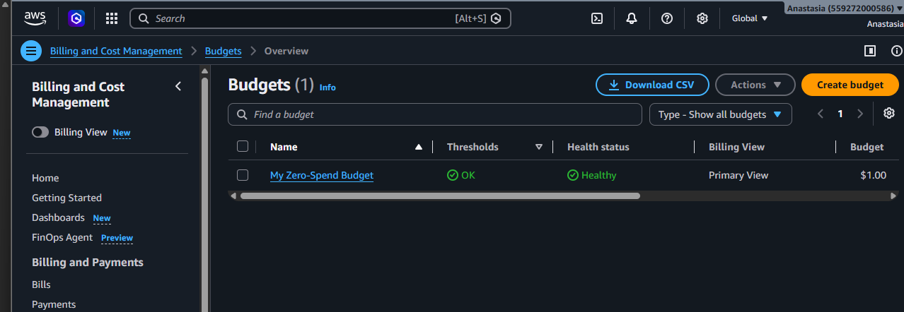

**Рисунок 1 - Бюджет `ZeroSpend` в списке `Budgets`.**

### Ответ на вопрос

**Что разрешает политика `AdministratorAccess`? Почему для повседневной работы нельзя использовать root?**

Политика `AdministratorAccess` предоставляет полный доступ к сервисам и ресурсам AWS. Root имеет максимальные права на весь аккаунт, поэтому для повседневной работы безопаснее использовать отдельного IAM-пользователя.

## Задание 2. Запуск экземпляра EC2

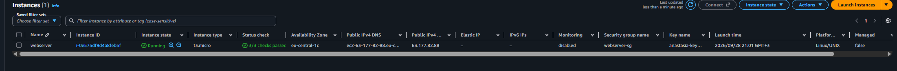

**Рисунок 2 - Экземпляр `webserver` в состоянии `Running` с пройденными проверками `Status check`.**

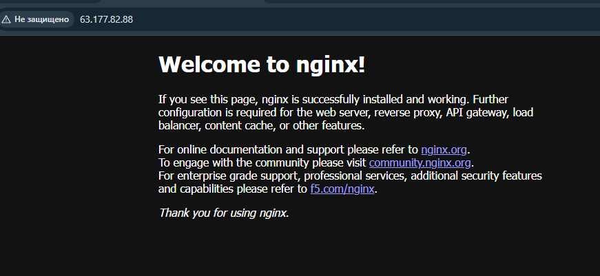

**Рисунок 3 - Приветственная страница nginx, открытая в браузере по публичному IP-адресу экземпляра.**

### Ответ на вопрос

**Что такое User data и когда выполняется этот скрипт? Выполнится ли он повторно после перезагрузки экземпляра?**

User data используется для автоматической первоначальной настройки экземпляра EC2. В данной работе скрипт установил `htop` и nginx и запустил nginx при первом запуске экземпляра. При обычной перезагрузке экземпляра этот скрипт повторно не выполняется.

## Задание 3. Мониторинг и диагностика

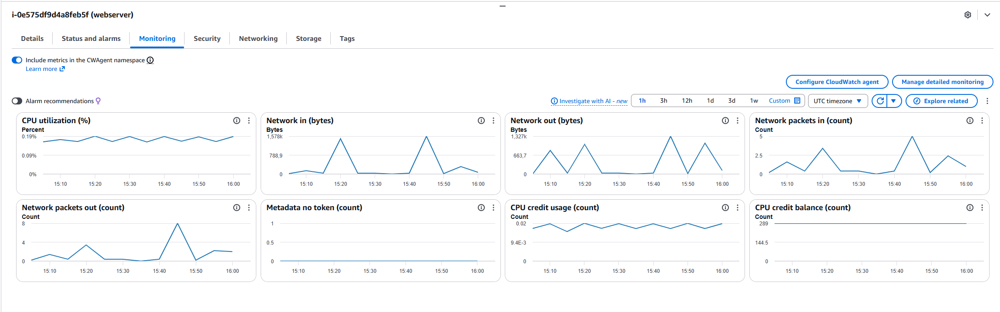

**Рисунок 4 - Вкладка `Monitoring` экземпляра `webserver`.**

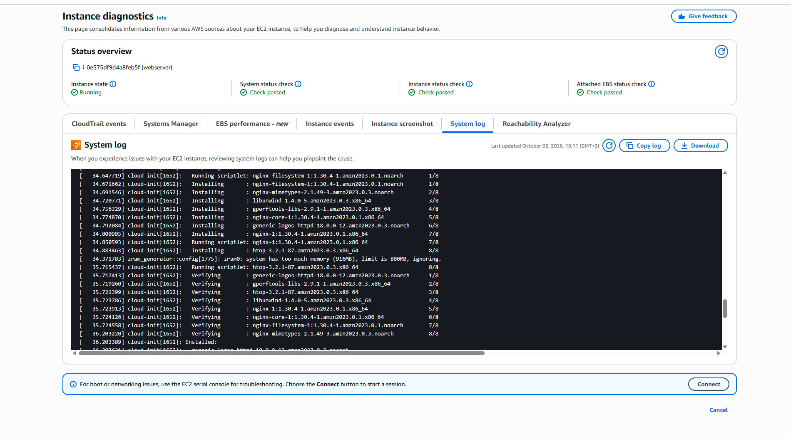

**Рисунок 5 - Фрагмент `System log` с установкой nginx.**

### Ответы на вопросы

**Какая из проверок укажет на проблему, которую можете исправить вы, а какая на проблему на стороне AWS?**

`Instance status check` показывает проблемы самого экземпляра и его операционной системы. `System status check` показывает проблемы инфраструктуры AWS, на которой работает экземпляр.

**В каких случаях стоит включать детальный мониторинг?**

Детальный мониторинг имеет смысл использовать, когда необходимо получать метрики чаще и быстрее отслеживать изменения нагрузки.

## Задание 4. Подключение по SSH

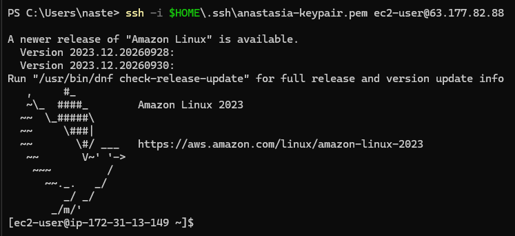

**Рисунок 6 - Успешное подключение к экземпляру `webserver` по SSH.**

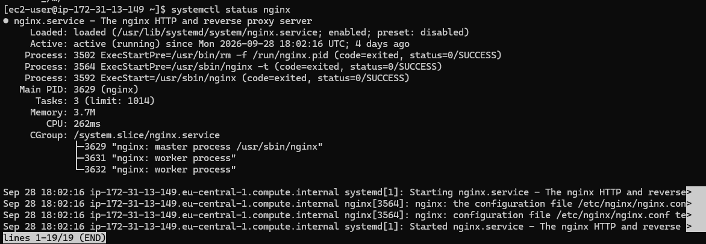

**Рисунок 7 - Вывод команды `systemctl status nginx`, подтверждающий работу nginx.**

### Ответ на вопрос

**Почему для входа на экземпляр EC2 используется ключ, а не пароль?**

SSH-ключ обеспечивает безопасную аутентификацию без передачи обычного пароля серверу. Приватная часть ключа хранится только на компьютере пользователя и не публикуется в репозитории.

## Задание 5. Статический сайт

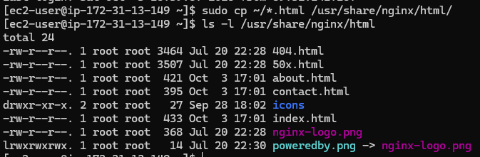

**Рисунок 8 - Вывод `ls -l /usr/share/nginx/html` с файлами статического сайта.**

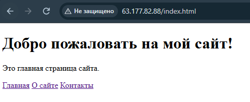

**Рисунок 9 - Главная страница статического сайта, открытая в браузере.**

### Ответ на вопрос

**Что делает `scp` и чем она похожа на SSH?**

`scp` используется для безопасной передачи файлов между локальным компьютером и удалённым сервером. Она использует SSH-соединение, поэтому для доступа к EC2 применяется тот же SSH-ключ.

## Задание 6. Управление экземпляром через AWS CLI

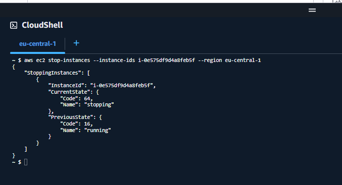

**Рисунок 10 - Команда `aws ec2 stop-instances` и результат остановки экземпляра `webserver`.**

### Ответ на вопрос

**Чем `Stop` отличается от `Terminate`? За что вы продолжаете платить, пока экземпляр остановлен?**

`Stop` останавливает экземпляр, но сохраняет его данные и позволяет запустить его снова. `Terminate` удаляет экземпляр. Пока экземпляр остановлен, плата за его вычислительные ресурсы не взимается, но сохраняется плата за используемое хранилище EBS.

# Продвинутый уровень

## Задание 7. Организация и репозиторий на GitHub

Для выполнения продвинутой части использовалось приложение `open_capsules_php_functional` (TimeCapsule) и публичный репозиторий организации:

https://github.com/cavarnalia-cloud/timecapsule

### Ответ на вопрос

**Почему папка vendor/ и файл .env не попали в репозиторий? Найдите ответ в файле .gitignore**

Папка `vendor/` и файл `.env` указаны в `.gitignore`, поэтому Git их не добавляет в репозиторий. `vendor/` содержит установленные библиотеки, а `.env` - настройки приложения, в том числе данные для подключения к базе.

## Задание 8. Подготовка сервера

Для работы TimeCapsule на EC2 были установлены PHP, PHP-FPM, PostgreSQL, Composer, Git и необходимые PHP-модули.

### Ответ на вопрос

**Почему необходимые компоненты устанавливались вручную, а не через User data?**

User data использовался при первоначальном создании экземпляра для базовой настройки и установки nginx. Дополнительные компоненты понадобились позднее для развёртывания TimeCapsule на уже существующем экземпляре, поэтому они были установлены вручную.

## Задание 9. База данных PostgreSQL

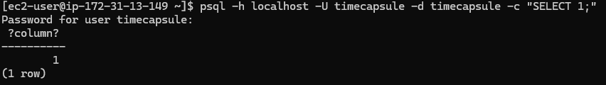

**Рисунок 11 - Успешное подключение к PostgreSQL и вывод команды `psql ... -c "SELECT 1;"`.**

## Задание 10. Развёртывание кода приложения на сервере

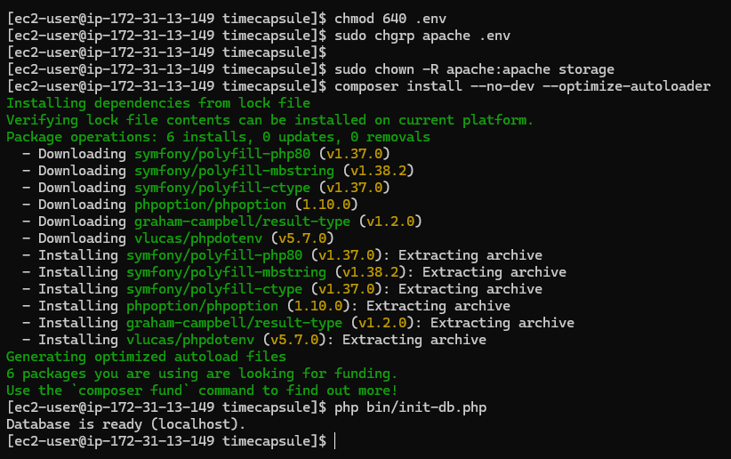

**Рисунок 12 - Успешное выполнение `php bin/init-db.php` с результатом `Database is ready (localhost)`.**

### Ответ на вопрос

**Почему пароль к базе данных хранится в файле .env на сервере, а не в коде в репозитории? Почему публичный репозиторий безопасен для этого приложения?**

Пароль базы данных является секретной информацией, поэтому он хранится в файле `.env` на сервере, а не в коде. Файл `.env` добавлен в `.gitignore` и не попадает в GitHub. Поэтому публичный репозиторий содержит код приложения, но не содержит паролей и других секретных данных.

## Задание 11. Настройка PHP-FPM и nginx

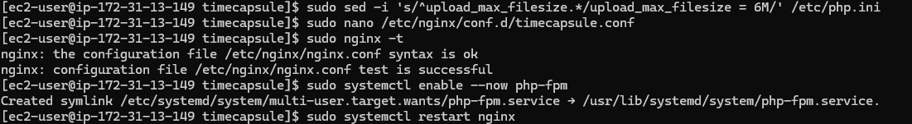

**Рисунок 13 - Успешный вывод команды `sudo nginx -t`.**

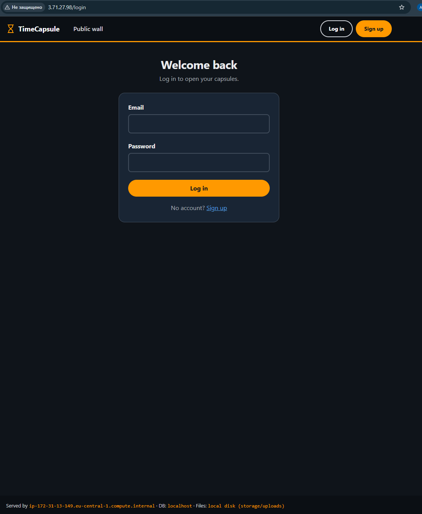

**Рисунок 14 - Работающее приложение TimeCapsule, открытое в браузере.**

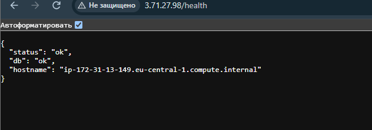

**Рисунок 15 - Ответ `/health` со статусами `status: ok` и `db: ok`.**

## Задание 12. Обновление приложения

Для специальности **Informatică aplicată** использовался **вариант A - ручной деплой**.

### Ответы на вопросы

**Что может увидеть посетитель, который откроет сайт во время `git pull`?**

Во время `git pull` файлы приложения обновляются непосредственно в рабочей директории. Пользователь может открыть сайт в момент, когда обновление ещё не завершено, и получить ошибку или некорректно работающую страницу.

**Что произойдёт, если после `git pull` не выполнится `composer install`?**

Если новая версия приложения требует новых зависимостей, они не будут установлены. В результате приложение может работать неправильно или полностью перестать запускаться.

## Задание 13. Новая версия, поломка и откат

**Рисунок 16 - Новая версия TimeCapsule с добавленной строкой `Author: Anastasia Cavarnali`.**

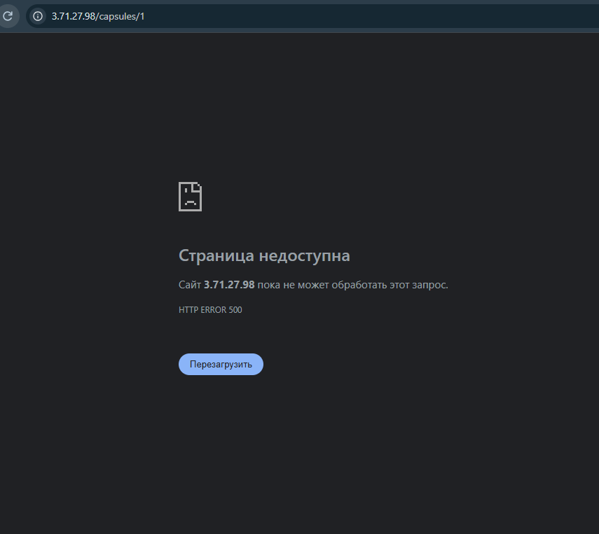

**Рисунок 17 - Ошибка HTTP 500 после намеренно сломанного деплоя.**

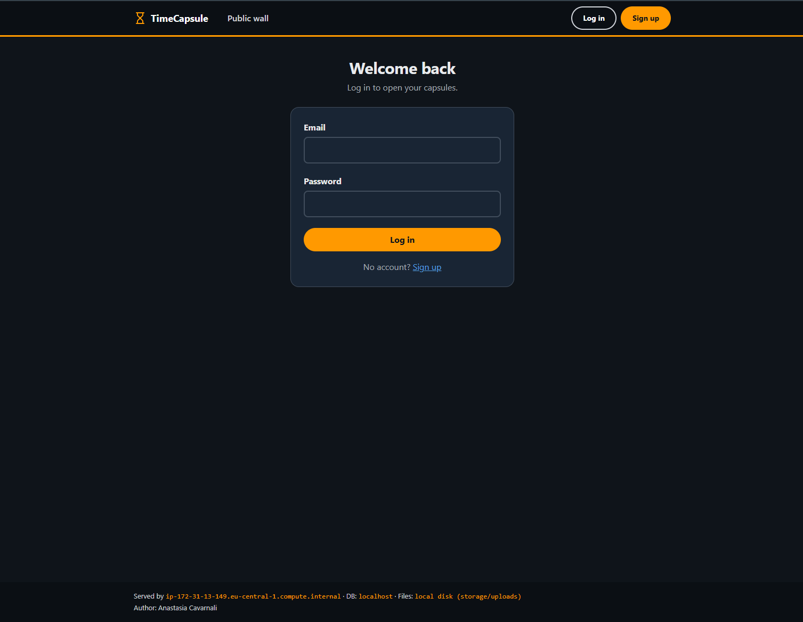

**Рисунок 18 - Работающий сайт TimeCapsule после `git revert` и повторного деплоя.**

### Ответы на вопросы

**Почему /health отвечает ok, хотя главная страница не работает? Что на самом деле проверяет этот адрес? Чего не хватает такой проверке?**

`/health` проверяет только определённые компоненты приложения и соединение с базой данных. Он не выполняет полный пользовательский сценарий и не рендерит проблемный шаблон `views/layout.php`, поэтому не обнаружил данную ошибку.

**Сколько времени сайт был сломан? Из каких шагов сложилось это время? Как можно было бы сократить его?**

Сайт не работал с момента загрузки версии с ошибкой до успешного отката на рабочую версию. За это время нужно было заметить ошибку, выполнить `git revert`, отправить изменения в GitHub и заново обновить приложение на сервере. Сократить время можно с помощью автоматических тестов перед деплоем и автоматизации самого процесса развёртывания.

## Задание 14. Архитектура и решение

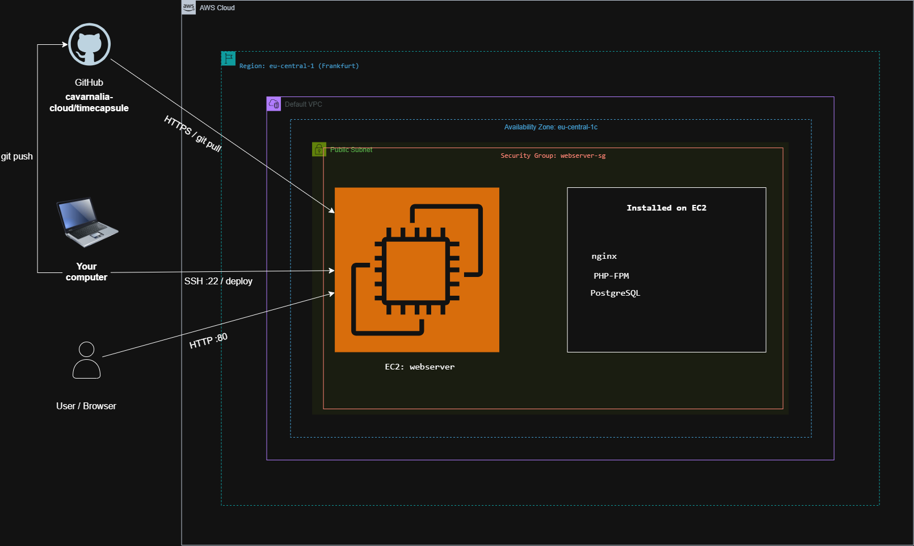

**Рисунок 19 - Архитектура развёртывания приложения TimeCapsule в AWS.**

### ADR

[ADR-0001 - Способ развёртывания TimeCapsule](docs/adr/0001-deploy-method.md)

# Контрольные вопросы

## 1. Как проходит запрос от браузера до базы данных в вашем развёртывании? Какую роль играет каждая программа?

Браузер отправляет HTTP-запрос на экземпляр EC2, где его принимает nginx. Для динамических страниц nginx передаёт запрос PHP-FPM, который выполняет PHP-код TimeCapsule. При необходимости приложение обращается к PostgreSQL, получает данные и формирует ответ, который через PHP-FPM и nginx возвращается в браузер.

## 2. Почему сервер может скачивать код из репозитория, но не может отправлять в него изменения? Почему для сервера это правильно?

Репозиторий `timecapsule` публичный, поэтому сервер может выполнять `git clone` и `git pull` без прав записи. Для `git push` необходимы авторизация и права на изменение репозитория. Серверу такие права не предоставлялись, что уменьшает риск изменения репозитория при компрометации сервера.

## 3. Что произойдёт с загруженными пользователями файлами, если удалить экземпляр EC2? Как это связано с тем, что вы знаете об EBS?

Загруженные файлы TimeCapsule находятся на диске экземпляра. Если EC2 будет удалён вместе с его EBS-томом, эти файлы будут потеряны. Для важных пользовательских данных в реальном проекте следует использовать постоянное хранилище, не зависящее от конкретного экземпляра.

## 4. Что общего у вашего deploy.sh или последовательности команд варианта A с тем, что делают системы CI/CD? Чего в вашем процессе ещё не хватает?

Ручной деплой включает получение новой версии кода, установку зависимостей, обновление базы и перезапуск приложения. Эти действия похожи на этапы автоматического процесса CI/CD, но выполняются вручную. Не хватает автоматического запуска, тестирования новой версии и автоматической проверки результата развёртывания.